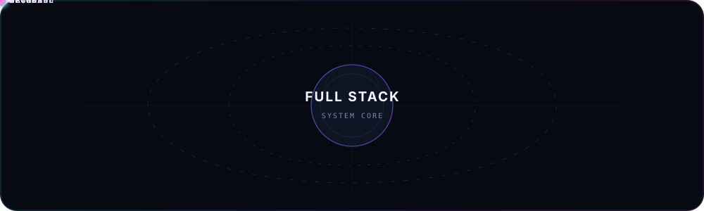

<div align="center">
  
</div>

<div align="center">
  <strong>Building polished interfaces, reliable backends, AI-assisted systems and security-focused developer tools.</strong>
  <br/><br/>
  <code>DESIGN → BUILD → VERIFY → SHIP → IMPROVE</code>
</div>

<br/>

<div align="center">
  
</div>

## `01 // Developer Console`

```yaml
identity: Mridul Gupta 
role: Frontend + Backend Developer
engineering_focus:
  - Full-stack product development
  - AI-assisted applications
  - Backend APIs and automation
  - Security and reverse-engineering platforms
  - Real-time Formula racing experiences
current_mode: Building independently, validating carefully, shipping progressively
```

I build products across the complete application path: **interface, API, data, automation, deployment and iteration**. My repositories are organized as an evolving engineering portfolio rather than a collection of disconnected tutorials.

<div align="center">
  
</div>

## `02 // Core Stack`

<div align="center">
  
</div>

<br/>

| Layer | Working toolkit |
|---|---|
| **Frontend** | TypeScript, JavaScript, React, Next.js, HTML, CSS |
| **Backend** | Python, FastAPI, API design, automation workflows |
| **Data** | PostgreSQL, structured application data, real-world data ingestion |
| **Platform** | Docker, GitHub Actions, Cloudflare Pages, Git-based delivery |
| **Specialization** | AI products, reverse engineering, static malware analysis, real-time dashboards |

## `03 // Project Control Deck`

> Repository format: **`Project No.-Project Name-Version`**. A version suffix is used only when it is part of the project identity, as with AutoRev.

| No. | Repository / Project | State | Progress | Domain |
|---:|---|---|---:|---|
| 01 | **1-WeatherLens** | Shipped | `██████████ 100%` | Weather web application |
| 02 | **2-DweLLIQ** | Shipped | `██████████ 100%` | AI real estate + interior SaaS |
| 03 | **3-QueueLess** | Production build | `████████░░ 80%` | AI virtual queue platform |
| 04 | **4-PassGen** | Shipped | `██████████ 100%` | Python terminal CLI |
| 05 | **5-HexaCALM** | Production build | `████████░░ 80%` | Multi-tenant college SaaS |
| 06 | **6-Coding-360** | Foundation | `█▌░░░░░░░░ 15%` | Open learning repository |
| 07 | **7-AutoRev-1.0** | Production build | `████████░░ 80%` | Reverse-engineering platform |
| 08 | **8-AutoRev-2.0** | Production build | `████████░░ 80%` | AI static malware analysis |
| 09 | **9-ApexWall** | Foundation | `█▌░░░░░░░░ 15%` | Modular Formula racing platform |
| 10 | **10-Pit-Wall-360** | Active prototype | `████▌░░░░░ 45%` | Real-time F1 dashboard |
| 11 | **11-PitWall-360-NewGen** | Active prototype | `████▌░░░░░ 45%` | Zero-infrastructure F1 dashboard |
| 12 | **12-The-Pit-Wall-360** | Active prototype | `████▌░░░░░ 45%` | Immersive Next.js + OpenF1 experience |

<details open>
<summary><strong>SHIPPED SYSTEMS // 100%</strong></summary>
<br/>

### `1-WeatherLens`
A responsive weather website focused on fast, clear access to current weather information.

### `2-DweLLIQ`
An **AI-powered real-estate and interior platform for India**, designed and built with the product depth, structure and polish expected from a funded SaaS company.

### `4-PassGen`
A terminal-only Python CLI that creates personalized passwords from a chosen length, character categories, an optional specific word, digits, symbols and initials.

</details>

<details>
<summary><strong>PRODUCTION BUILDS // 80%</strong></summary>
<br/>

### `3-QueueLess`
An AI-powered virtual queue-management system for India that helps citizens avoid long physical queues at banks, hospitals and government offices. It predicts better visit times using real counter data submitted by on-ground volunteers.

### `5-HexaCALM`
**Leave processing, finally fixed.**

Hexa-CALM is a cloud-native, multi-tenant SaaS that replaces the broken Medical/OD-to-attendance pipeline found in legacy college ERPs. Every onboarded college receives its own subdomain: `[slug].hexa-calm.com`.

Its core innovation is the **College-Hexa Agent**, a three-mode automation engine—`FULL ON`, `SUGGEST` and `OFF`—designed to reduce a typical one-to-three-week Medical/OD reflection delay to under 24 hours, without putting an LLM in the routine processing path.

### `7-AutoRev-1.0`
An AI-assisted reverse-engineering platform connecting **Ghidra analysis**, a **FastAPI backend** and a **React frontend**.

### `8-AutoRev-2.0`
AI-assisted static malware analysis powered by the **A.R.I.S.E. Engine**:

> Automated Reverse Intelligence & Security Engine — a solo rebuild with a production-grade target.

</details>

<details>
<summary><strong>RACING LAB // 45%</strong></summary>
<br/>

### `10-Pit-Wall-360`
The original fan-first real-time F1 dashboard concept: every lap, every battle and every story, built to make live Formula racing data more accessible.

### `11-PitWall-360-NewGen`
A real-time F1 dashboard featuring a race countdown, driver and constructor standings, the last-race podium, qualifying results and the season calendar.

`Single HTML file · Jolpica API · Cloudflare Pages · zero infrastructure cost`

### `12-The-Pit-Wall-360`
A free, immersive real-time F1 dashboard for fans who cannot justify the paywall, combining live data, race-day animation and audio.

`Next.js · OpenF1`

</details>

<details>
<summary><strong>FOUNDATION SYSTEMS // 15%</strong></summary>
<br/>

### `6-Coding-360`
A public, open-learning repository documenting a structured journey through programming fundamentals and beyond. Built openly so developers, students and curious learners can study alongside it, reference it or reuse the best notes.

**No fluff. Clean code. Real concepts.**

### `9-ApexWall`
A next-generation modular Formula racing platform planned across static race intelligence, live-session enrichment, circuit tracking, race-pulse analysis and historical replay.

</details>

## `04 // Engineering Principles`

```text
01. Interfaces must feel intentional.
02. Backends must remain understandable.
03. AI should accelerate judgment, not replace it.
04. Security belongs in the design—not at the end.
05. Every project needs a clear product reason to exist.
06. Progress is measured by working systems, not repository count.
```

## `05 // Current Mission`

```text
[▓▓▓▓▓▓▓▓▓▓] Build projects with real product depth
[▓▓▓▓▓▓▓▓░░] Strengthen full-stack engineering
[▓▓▓▓▓▓░░░░] Improve independent problem solving
[▓▓▓▓░░░░░░] Expand public technical documentation
```

<div align="center">
  
  <strong>BUILD THE INTERFACE. ENGINEER THE SYSTEM. OWN THE RESULT.</strong>
  <br/><br/>
  <sub>Private product work • Public engineering identity • Continuous improvement</sub>
</div>
